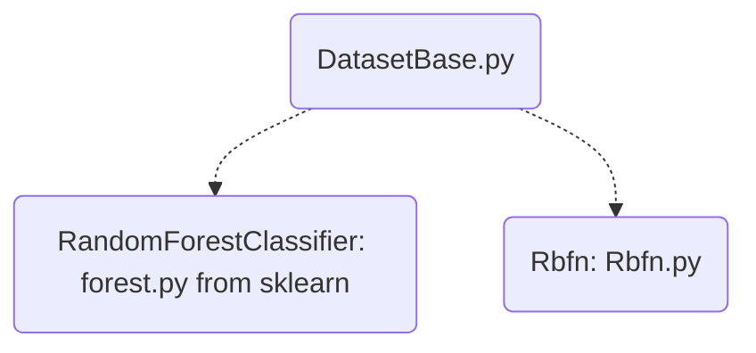

# Classifier for SMIDA
[List of Documentation Files](menu.md)

They are selected in *evaluation.py* by `-- clf`

-  `rf`: RandomForrest
-  `rbfn`: Radial Basic Function Networks

## Random Forrest
See documentation of [RandomForestClassifier](https://scikit-learn.org/stable/modules/generated/sklearn.ensemble.RandomForestClassifier.html)

## Radial Basic Function Networks

The definition is in "rbfn/Rbfn.py" and "rbfn/Rbfn_paper.py".
*Martin: I don't really know, wich is used.*

### fit (rfbn.py, rfbn_paper.py)

Main routine to train the classifier.

1. find n_clusters support vectors
2. estimate n_clusters \betas
3. find n_classes weigths

Here is more to do, to understand the code.