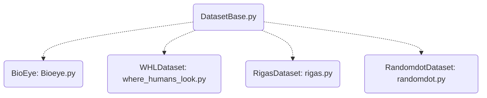

# DATASETS in SMIDA
[List of Documentation Files](menu.md)

get_dataset (evaluation.py) will load different datasets by classes from folder datasets.

## Known Datasets

There are different conversion functions and tools to prepare the data.

### Where humans look

- **15 participants** of **age 18-35**
- **1003 images** with size: 1024px to 405-1024px (779 landscape and 228 portrait, natural indoor and outdoor scenes)
- free viewing for 3 sec.
- eyetracker: ETL 400 ISCAN (240Hz)

- [Overview](https://people.csail.mit.edu/tjudd/WherePeopleLook/index.html)
- [Fixations Online](http://people.csail.mit.edu/tjudd/WherePeopleLook/interactiveWebsite/seeFixations.html)

## Code
### Parent: DatasetBase

Brings the basic commands to deal with datasets.

| Command | Purpose |
| ------------- | ----------- |
| get_screen_params | pix_per_mm, screen_dist_mm, screen_res |
| get_users | list of user IDs |
| get_cases | list of different experiments (multiple cases per user) |
| load_data(user,case) | loading x and y coordinates for each user from the raw data |
| load_data_no_nan | see load_data |
| get_stimulus | path to stimulus |
| *load_training()* | return x (sampels) and y (user id) for training |
| *load_testing()* | return x (sampels) and y (user id) for testing |

Italic styled commands are from child classes, but i think they should be mentioned here.

### Childs

These classes specify the use for different data types (see above).
They bring different informations regarding to the data.

#### load_Training

Can Split trajectories into partitions.
Return dfs (sampels) and ids (user).
 
| Bioeye | randomdot and rigas | where_humans_look |
| --- | --- | --- |
has only *users* | have *cases* |  return *dfs_train* and *dfs_test* initialized by class |

Some Thoughts:
- For **UserID**-Prediction we need different samples of one user in train and test.
- For **Gender/OtherGeneral**-Prediction we need different users in train/test.
- There should be never the same data in train/test.

Some Ideas:
- We should have get_train_test_setting() which returns a list of specific users/cases for train and test
- The data will be then loaded directly with load_data

