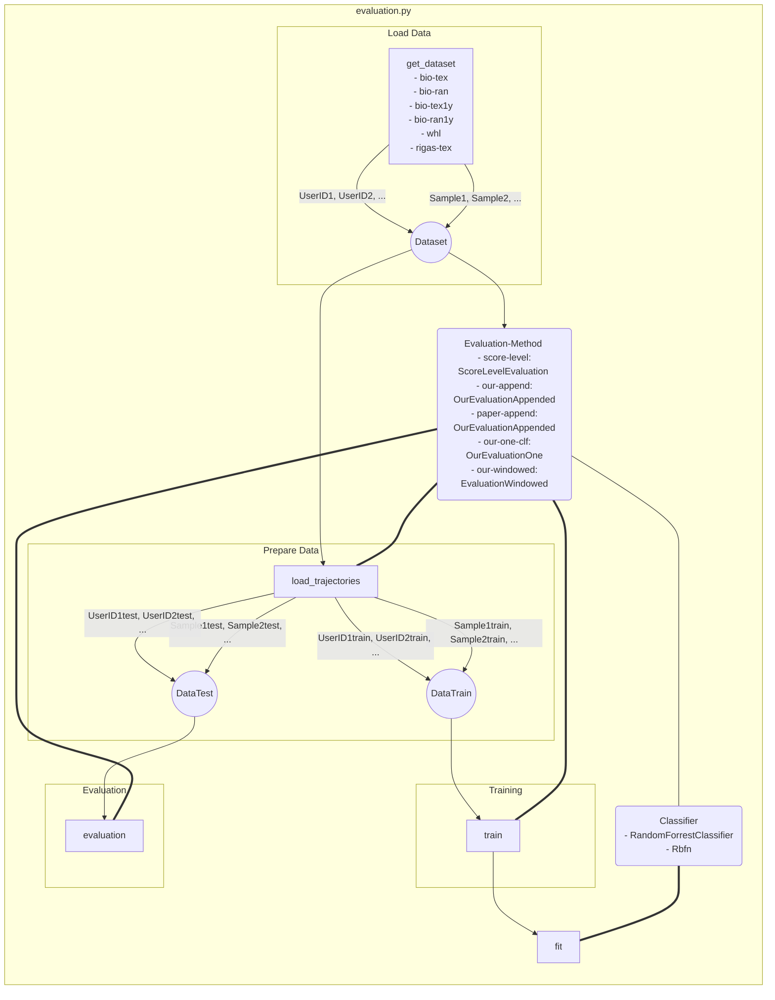

# Evaluation of SMIDA
[List of Documentation Files](menu.md)

**OUTDATED**: Train and Evaluate is divided now!

This document gives an overview of evaluation options and the program structure of SMIDA.
There are other documents, if you are looking for an [OVERVIEW](OVERVIEW.md) of files or want to [SETUP](SETUP.md) the program. Further more Details are in [README](/README.md).

## Main Routine
The Routine to start an evaluation is [*Evaluation.py*](https://gitlab.informatik.uni-bremen.de/ascadian/schau_mir_in_die_augen/blob/master/scripts/evaluation.py) in the folder Scripts.
It's a Python routine and have to run in the Docker Container or in a Python enviroment.
You have to be in the main Folder.

[Enlarge](https://mermaidjs.github.io/mermaid-live-editor/#/edit/eyJjb2RlIjoiZ3JhcGggVERcblxuY2JfZGF0YXNldChkYXRhc2V0X3NlbGVjdF9jYikgLS0-IGNiX3N0aW11bGlcbmNiX3N0aW11bGkoc3RpbXVsaV9zZWxlY3RfY2IpIC0tPiBjYl91c2VyXG5jYl9zdGltdWxpIC0tLSBsb2FkX2ltZyhsb2FkX2ltZ19ib2tlaClcbmNiX3VzZXIodXNlcl9zZWxlY3RfY2IpIC0tPiB1cF9kYXRhcGxvdFxuY2JfdXNlciAtLT4gdXBfdmVsb3Bsb3RcblxuY2JfY3JvcChjbGlwX3RvZ2dsZV9jYikgLS0-IHVwX3RpbWVcbmNiX21hcmtlcmxhc3QobWFya2VyX2xhc3RfdG9nZ2xlX2NiKSAtLT4gdXBfZGF0YXBsb3RtYXJrZXJcbmNiX29mZnkoeV9vZmZzZXRfc2xpZGVyX2NiKSAtLT4gdXBfdGltZVxuY2JfdGltZSh0aW1lX3NsaWRlcl9jYikgLS0-IHVwX3RpbWVcbmFuaW1hdGUgLS0-IGFuaW1hdGVfdXBkYXRlXG5hbmltYXRlX3VwZGF0ZSAtLT4gY2JfdGltZVxuY2JfaXZ0X3RocmVzaG9sZChpdnRfdGhyZXNoX3NsaWRlcl9jYikgLS0-IHVwX3ZlbG9wbG90XG5jYl9pdnRfZHVyYXRpb24oaXZ0X21pbl9kdXJfc2xpZGVyX2NiKSAtLT4gdXBfdmVsb3Bsb3RcblxudXBfZGF0YXBsb3QoaW5pdGlhbGl6ZV9wbG90ZGF0YSkgLS0-IHVwX2RhdGFwbG90bWFya2VyKHVwZGF0ZV9wbG90ZGF0YV9tYXJrZXIpXG51cF9kYXRhcGxvdCA9PT4gdHJhamVjdG9yaWVzXG51cF9kYXRhcGxvdCA9PT4gdmVsb2NpdGllc1xudXBfZGF0YXBsb3QgPT0-IGNiX3RpbWVcblxudXBfdGltZSh1cGRhdGVfdGltZSkgLS0-fHVwZGF0ZV90YWJsZV90b2dnbGV8IHVwX3RhYmxlKHVwZGF0ZV90YWJsZSlcbnVwX3RpbWUgLS0-fHVwZGF0ZV92ZWxvY2l0eV90b2dnbGV8IHVwX3ZlbG90aW1lXG5cbnVwX3ZlbG9wbG90KHVwZGF0ZV92ZWxvY2l0eV9wbG90KSAtLT4gXG51cF92ZWxvdGltZSh1cGRhdGVfdmVsb2NpdHlfcGxvdF90aW1lYmFyKVxuXG50cmFqZWN0b3JpZXMgLi0-IHVwX3RpbWVcbnRyYWplY3RvcmllcyAuLT4gdXBfZGF0YXBsb3RtYXJrZXJcbnZlbG9jaXRpZXMgLi0-IHVwX3ZlbG9wbG90IiwibWVybWFpZCI6eyJ0aGVtZSI6ImRlZmF1bHQifX0)

### Steps
It will do the following:

1.  Preperation (only settings)
	1.  Initialize [DATASETS](DATASETS.md)
	2.  Initialize [CLASSIFIER](CLASSIFIER.md): RandomForestClassifier or Rbfn
	3.  Initialize [METHOD](METHODS.md) with Classifier
2.  Training Method with data
	1.  load_trajectories (slow)
	2.  train
	    -  provide_feature
	    	- trajectory_split_and_feature (very slow, will calculate all feature)
	    -  fit classifier (very slow)
3.  Evaluation with eval_subset
	1. evaluation (slowest)
	    -  predict_trajectory
	    	- trajectory_split_and_feature (very slow, will calculate all feature)
    	    -  Will make predictions with different amount of sampels (1,2,...,10,20,...,60,100,200,300,...)
	2. saving Results
	

### Parameters
You can run it with these parameters:

| Parameter | Options or Default | Purpose |
| ------------- | ---------- | ---------- |
| method | 'score-level', 'our-append', 'paper-append', 'our-one-clf', 'our-windowed' | ... |
| dataset | 'bio-tex', 'bio-tex1y', 'bio-ran', 'bio-ran1y', 'whl', 'rigas-tex', 'rigas-ran' | Select the data to train on. |
| *test_dataset* | Datasets from above. If not defined, previous selection will be used ... i think | Select data to test with. |
| clf | ('rf' not implemtend?), 'rbfn' | Select the [Classifier](Classifier) |
| *rf_n_estimators* | default=400 | The number of trees in the forest |
| *rbfn_k* | default=32 | The number of clasters |
| *window_size* | default=100 | Window size in seconds for windowed evaluation |
| *ivt_threshold* | default=50 | Velocity threshold for ivt. |
| *ivt_min_fix_time* | default=0.1 | Minimum duration to count as fixation for ivt. |
| *whl_train_samples* | default=1 | Training samples used in WHL dataset per user. |
| *whl_test_samples* | default=1 | Testing samples used in WHL dataset per user. |
| *score_level_1y* |  action='store_true' ?? | optional by choose T or F
| *score_level_1y_train* |  action='store_true' ?? | optional by choose T or F
| *ul* | default=None | Limit of Users (randomly selected) | 
| *seed* | default=42 | ? |
| *use_eye_config* | default='LEFT' | used to have five eyes data possibilities: left eye data, right eye data, average gaze points of both eyes, combine features of both eyes and average features of both eyes |

All parameters written in *italic* style are optional.

Example for a valid call:
`evaluation.py --method our-one-clf --dataset bio-tex --classifier rf `

*Note: Names of Paraeter are used for naming a file. At the Moment we have reached maximal length of filename. To add new Parameters this has to be fixed.*

