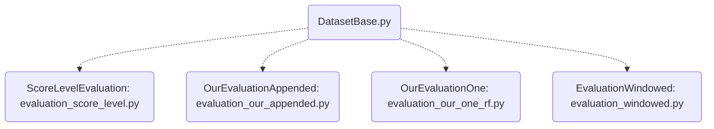

# Methods of SMIDA for Evaluation
[List of Documentation Files](menu.md)

They are selected in *evaluation.py* by `-- method`

-  `score-level`: ScoreLevelEvaluation
-  `our-append`: OurEvaluationAppended
-  `paper-append`: OurEvaluationAppended with `paper_only=true`
-  `our-one-clf`: OurEvaluationOne
-  `our-windowed`: EvaluationWindowed

## Parent: BaseEvaluation

Parent for all evaluation classes

Some Important functions are brought by childs:

-  *trajectory_split_and_feature*
	Returns feature list.
-  *train*
-  *evaluation*
	Calls [*weighted_evaluation*](#weighted_evaluation) of BaseEvaluation (.5/.5 for Sac and Fix or 1 whren there is only one [CLASSIFIER](CLASSIFIER.md)).

### load_trajectories

Uses *dataset.load_training* and *dataset.load_testing* to load X,Y for training and testing data.
The Form is: X=Sample Arrays, Y=UserID with len(X)=len(Y).

With optional Parameter *limit* it can reduce number of datasets

### provide_feature

Gets a list of trajectories, labels and datset?
Return stuff?

Will use *trajectory_split_and_feature* introduced by childs (see below) to get a list of values for multiple features of saccades and fixations.

This will take a while.
It is using memory (cache) function of python to speed up future calls.

### weighted_evaluation

## Childs

<!-- Martin: Thye are very simmilar and the code could be reduced i think -->

Overview of differences:

| function | trajectory_split_and_feature | train |
| ----------- | ------------------------------ | ------ | 
| OurEvaluationAppended | *trajectory_split_and_feature_cached*, some filtering and paper only option| clf_sac, clf_fix |
| OurEvaluationOne | *trajectory_split_and_feature_cached* | clf|
| ScoreLevelEvaluation | *trajectory_split_and_feature_cached* and some filtering | clf_sac, clf_fix |
| EvaluationWindowed | angle conversion, *sliding_window* and more | clf |

Functions are otherwise simmilar.

The Seperation Algortihms are described in [SEPERATION](SEPERATION.md).

### train

Gets stuff from *provide_feature* and uses *clf.fit* from [CLASSIFIER](CLASSIFIER.md).

