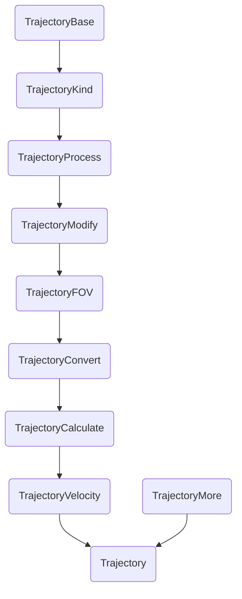

# Trajectory class
[List of Documentation Files](menu.md)

Some notes to handle the Trajectory class for storing eye movement data.

## kind

The idea of the Trajectory class it to save the type of the data (angle or pixel). So you everytime know the kind of the data wich is stored.
The class try to prevent accidental changes.

You can use ```get_trajectory(kind)``` to always be shure what type the output is.
If the Format of the data is not the same, it will everytime be converted.

The same is true for ```get_velocity(kind)```.

Be careful with ```xy``` or ```velocity``` property it will always return the stored type.

## further functionality

The trajectory class provides some more information like ```velocity``` and have multiple methods to manipulate your data.

Every change will be documented int ```_processing```

**List of important Methods**

| name | purpose |
| --- | --- |
|  ```convert_to(kind) ``` | will change type of stored data |
|  ```get_trajectory(kind) ``` | return trajectory in specific type |
|  ```get_velocity(kind) ``` |  return velocity of trajectory in specific type 
|  ```apply_filter ``` | modify data with filter |
|  ```interpolate ``` | do linear interpolation for NaN |
|  ```remove_duplicates ``` | remove unchanged values |
|  ```invert_y ```,  ```offset ```| self explaining

## Multiple Trajectories
... can be collected in Trajectories-Class.

This class is itterable and returns arrays with data from items.

## Internal Structure

