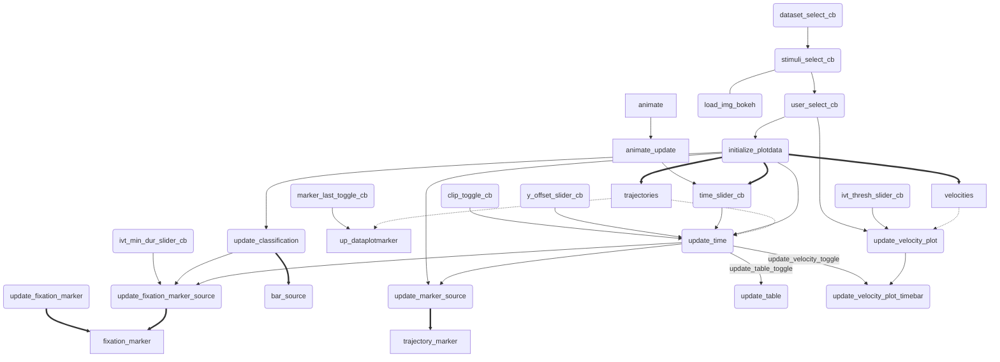
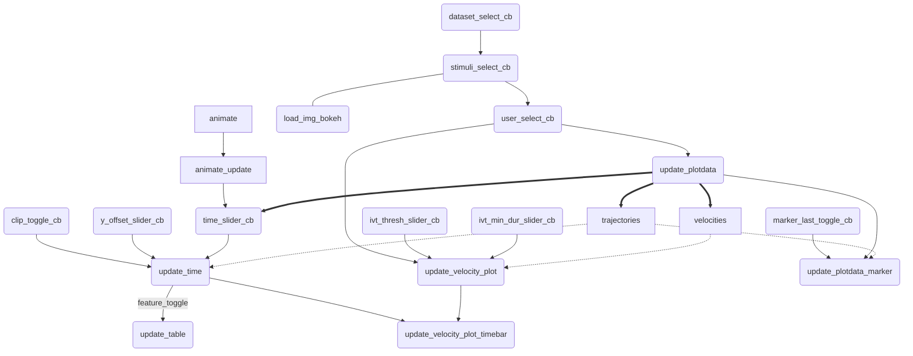

[List of Documentation Files](menu.md)

# Data visualization with BOKEH

See thoughts on [Wiki-Page](https://gitlab.informatik.uni-bremen.de/cgvr/smida2/schau_mir_in_die_augen/wikis/EyeTracking%20Visualization) [remove link before publication]

## General

### Installation

If not already installed, run `pip3 install bokeh`.  
Don't use `pip install bokeh`, you want a newer python version.  
You can check your python version used by bokeh with `bokeh info`.

### Start

To start a BOKEH Server write `make bokeh` in Terminal.  
Now you can use the returned link to acess it.  
To stop use "Strg + C" in Pycharm.

The acessed script is "schau_mir_in_die_augen/visualization/gui_bokeh.py"

## Description of Tool

See [Visualization Paper](https://gitlab.informatik.uni-bremen.de/cgvr/smida2/visualization_paper) and [Video](https://seafile.zfn.uni-bremen.de/f/52b979ec4f114519b6bd/).

## Interface

### Settings

| Section | Content |
| --- | --- |
| Headline | Color of Users |
| Save/Load | saving/loading of Settings |
| Select Data | |
| Select Annotation | Switch Trajectory, Saccades, Fixation and Counts on/off. Change visualization of Duration |
| Animation | Beside Animation: Reset Time, Mark Trajectory (ends) and Ping (find trajectory) |
| Coustomization | One Color for all Fixations Numbers and Markers, Coloring of Image. |

#### Load and Save Settings
To Load/Save Settings enter every name or path you want and press load/save.
With `[bet]xxx` you will use the general path in the repository. To commit your file for others, you have to manually add it in [Git](GITLAB.md).
With `[bus]xxx` you will use your home directory. Click `Open Folder` to get there.

If you want to load a specific view, you first have to move the images in plot to deactivate autoranging.
Than you can click "load view".

### Trajectory Plot (+ Feature Table)

Below the Trajectory Plot there are the settings to modify the data:
- interpolation
- Smoothing
- Removal of duplicates
- centering
- visual cropping

Bewlow the Feature Table there is:
- data-scaling
- x/y- offset

### Velocity Plot

Only Settings for IVT

### Prediction

| Columns | Content |
| --- | --- |
| 1 | selecting and loading the Evaluator |
| 2 | Showing the results, select the user and set the Parameter |
| 3 | information of classififaction
| 4 | information of classififaction
| 5 | styling of lines and coloring

### Training

Select Parameters and directly train evaluators.

## Applications


### Visualization of Prediction

1. Train some classifier (See [Training](EVALUATION.md) *todo: update this link*)
	- Make shure you save modelfile in [model]-folder
2. Start Bokeh
3. Scroll down and select your saved Evaluator.
4. Click "Use Parameters of Classifier"
5. Selected some trained user.
6. Click "Show Evaluation Result"
	- use the "Color Scale" to better divide the values.

## Insights

*Already Outdated!*


[Enlarge](https://mermaidjs.github.io/mermaid-live-editor/#/view/eyJjb2RlIjoiZ3JhcGggVERcblxuY2JfZGF0YXNldChkYXRhc2V0X3NlbGVjdF9jYikgLS0-IGNiX3N0aW11bGlcbmNiX3N0aW11bGkoc3RpbXVsaV9zZWxlY3RfY2IpIC0tPiBjYl91c2VyXG5jYl9zdGltdWxpIC0tLSBsb2FkX2ltZyhsb2FkX2ltZ19ib2tlaClcbmNiX3VzZXIodXNlcl9zZWxlY3RfY2IpIC0tPiB1cF9kYXRhcGxvdFxuY2JfdXNlciAtLT4gdXBfdmVsb3Bsb3RcblxuY2JfY3JvcChjbGlwX3RvZ2dsZV9jYikgLS0-IHVwX3RpbWVcbmNiX21hcmtlcmxhc3QobWFya2VyX2xhc3RfdG9nZ2xlX2NiKSAtLT4gdXBfZGF0YXBsb3RtYXJrZXJcbmNiX29mZnkoeV9vZmZzZXRfc2xpZGVyX2NiKSAtLT4gdXBfdGltZVxuY2JfdGltZSh0aW1lX3NsaWRlcl9jYikgLS0-IHVwX3RpbWVcbmFuaW1hdGUgLS0-IGFuaW1hdGVfdXBkYXRlXG5hbmltYXRlX3VwZGF0ZSAtLT4gY2JfdGltZVxuY2JfaXZ0X3RocmVzaG9sZChpdnRfdGhyZXNoX3NsaWRlcl9jYikgLS0-IHVwX3ZlbG9wbG90XG5jYl9pdnRfZHVyYXRpb24oaXZ0X21pbl9kdXJfc2xpZGVyX2NiKSAtLT4gdXBfc29fZml4YXRpb25fbWFya2VyXG5cbnVwX2RhdGFwbG90KGluaXRpYWxpemVfcGxvdGRhdGEpXG51cF9kYXRhcGxvdCA9PT4gdHJhamVjdG9yaWVzXG51cF9kYXRhcGxvdCA9PT4gdmVsb2NpdGllc1xudXBfZGF0YXBsb3QgPT0-IGNiX3RpbWVcbnVwX2RhdGFwbG90IC0tPiB1cF9zYWNmaXhcbnVwX2RhdGFwbG90IC0tPiB1cF90aW1lXG51cF9kYXRhcGxvdCAtLT4gdXBfc29fdHJhamVjdG9yeV9tYXJrZXJcblxudXBfc2FjZml4KHVwZGF0ZV9zYWNfZml4KVxudXBfc2FjZml4ID09PiB1cF9zb19iYXIoYmFyX3NvdXJjZSlcbnVwX3NhY2ZpeCAtLT4gdXBfc29fZml4YXRpb25fbWFya2VyXG5cbnJlX2ZpeGF0aW9uX21hcmtlcihyZWJ1aWxkX2ZpeGF0aW9uX21hcmtlcilcbnJlX2ZpeGF0aW9uX21hcmtlciA9PT4gZml4YXRpb25fbWFya2VyXG5cbnVwX3NvX2ZpeGF0aW9uX21hcmtlcih1cGRhdGVfZml4YXRpb25fbWFya2VyX3NvdXJjZSkgPT0-IGZpeGF0aW9uX21hcmtlclxuXG51cF90aW1lKHVwZGF0ZV90aW1lKSAtLT58dXBkYXRlX3RhYmxlX3RvZ2dsZXwgdXBfdGFibGUodXBkYXRlX3RhYmxlKVxudXBfdGltZSAtLT58dXBkYXRlX3ZlbG9jaXR5X3RvZ2dsZXwgdXBfdmVsb3RpbWVcbnVwX3RpbWUgLS0-dXBfc29fZml4YXRpb25fbWFya2VyXG51cF90aW1lIC0tPnVwX3NvX3RyYWplY3RvcnlfbWFya2VyXG5cbnVwX3NvX3RyYWplY3RvcnlfbWFya2VyKHVwZGF0ZV90cmFqZWN0b3J5X21hcmtlcl9zb3VyY2UpID09PiB0cmFqZWN0b3J5X21hcmtlclxuXG51cF92ZWxvcGxvdCh1cGRhdGVfdmVsb2NpdHlfcGxvdCkgLS0-IFxudXBfdmVsb3RpbWUodXBkYXRlX3ZlbG9jaXR5X3Bsb3RfdGltZWJhcilcblxudHJhamVjdG9yaWVzIC4tPiB1cF90aW1lXG50cmFqZWN0b3JpZXMgLi0-IHVwX2RhdGFwbG90bWFya2VyXG52ZWxvY2l0aWVzIC4tPiB1cF92ZWxvcGxvdCIsIm1lcm1haWQiOnsidGhlbWUiOiJkZWZhdWx0In19)

*I don't even know, which is more uptodate*



### Sources

*Alreday Outdated!*

| variable | object | purpose |
| --- | --- | --- |
| time_bar_source | stimulus, velocity | selected time |
| p_stim_trajectory_marker_source | stimulus | trajectory marker |
| p_stim_fixation_marker_source | stimulus | fixation marker
| table_source | table | |
| bar_source | velocity | fixation/saccade and names for time bars
| ? | stimulus | trajectory
| ? | velocity | trajectory

### Sub- and Updatefunction (and callbacks which update things)

*Alreday Outdated!*

| Name | Purpose | Comment |
| ------ | ------ | ----- |
| load_img_bokeh | load stimulus | |
| load_data | load trajectories | |
| get_colors | provide n colors| unspecific => extern? |
| get_user_color | return color for user | |
| get_user_name | return id_tag of user | |
| get_center_and_size | calculate cog_x, cog_y and size for multiple trajectories  | size not working fine |
| crop_move | crop data to image | other place? | |
| animate_update | move time slider one step | |
| update_time | update everything depending on time | |
| update_plotdata | load data, calculate velocities, update marker | maybe split? |
| update_plotdata_marker | update marker | |
| update_table | calculate feature and update table | |
| update_velocity_plot | calculate saccades and fixation and redraw plot | |
| update_velocity_plot_timebar | change time marker in velocity plot | todo: only data update |
| dataset_select_cb | update dataset, call stimuli_select_cb | |
| stimuli_select_cb | load_img_bokeh, user_select_cb | |
| user_select_cb | update_plotdata, update_velocity_plot, time_slider_cb |
| clip_toggle_cb | update_time | |
| marker_last_toggle_cb | update_plotdata_marker | |
| marker_toggle_cb | create or remove marker | |
| y_offset_slider_cb | update_time | |
| time_slider_cb | update_time | |
| animate | repetitive call animate_update | |
| ivt_thresh_slider_cb | update_velocity_plot | |
| ivt_min_dur_slider_cb | update_velocity_plot | |

### Debugging

Maybe look also in the [Setup](SETUP.md)

#### Configuration

In PyCharm you have to set the Run/Debug Configurations for "gui_bokeh.py":

|  |  |
| --- | --- |
| Script path (possible) | ```/home/USERNAME/.local/bin/bokeh``` |
| Module name (better alternative?) | bokeh |
| Parameters  | ```serve gui_bokeh.py --dev``` |

The working directory have to stay in the visualization folder.

#### Other Errors

- `pip install --upgrade --force-reinstall pillow`
- `pip install matplotlib`

- If you have an error while running **gui_bokeh** regarding **PIL** and it's not solved by installing **Pillow** (`pip install --upgrade --force-reinstall pillow` could be helpful), 
  then make sure you have initialized the modules by `git install lfs` and pulled by  `git lfs pull`.